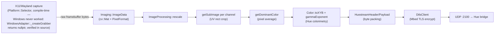

# Stack comparison — huenicorn vs. Aurora-App-Linux vs. Aurora-App-Windows

Captures the architecture actually built so far, grounded against huenicorn
as a starting comparison, with a focus on two things: how data physically
moves through each stack, and which dependency library is doing the
interpreting/transporting at each step. Diagrams show one tick's worth of
data, capture through bridge, for both the video pipeline (huenicorn has an
equivalent) and the audio pipeline (huenicorn doesn't — see Phase 2.5 in
`ImplementationPlan.md`); the `why` behind the module split itself is
covered in `ModuleSplitPlan.md`/`RuntimeAnalysis.md`, not repeated here.

## 1. huenicorn — one process, one thread, one of everything

Verified against the actual source (`Core/Runtime.hpp`): one `IGrabber*`
(compile-time-selected adapter), one `Stream::Streamer`, `Hue::Api::Channels`
embedded directly as `Runtime` members (not behind a generic output
interface), all driven by a single `_update()` call inside
`_startStreamingLoop()`'s own thread. The web UI (`httplib`) runs on a
second thread purely for setup, not part of the streaming data path.

**Libraries doing the interpreting:**
- **OpenCV** (`cv::Mat`) — the in-memory image representation from capture
  through cropping/averaging; `PixelFormat` is huenicorn's own tag riding
  alongside it, since `cv::Mat` itself doesn't encode channel order.
- **glm** — `vec2`/`ivec2` for UV rects and resolutions; pure math, doesn't
  touch raw bytes.
- **nlohmann::json** — reads/writes `config.json`/profile JSON directly
  inline in `Core::Config`/`Runtime`, no dedicated store class.
- **libcurl** — HTTPS to the CLIP v2 REST API (bridge discovery,
  entertainment config lookup) — its own TLS backend, unrelated to Mbed TLS.
- **Mbed TLS** — the DTLS-PSK handshake and encryption for the binary
  HueStream v2 protocol, UDP port 2100 — a second, independent TLS stack
  from curl's, for a different protocol on a different port.
- **X11/Xext/Xrandr**, or **libpipewire+glib** — whichever compile-time
  adapter is active on Linux; each turns OS/compositor-owned pixel memory
  into the same `Imaging::ImageData` shape. `WindowsAdapter` exists but
  `_createGrabber` just returns `nullptr` — no DXGI code, no working
  capture, never functional on Windows.

## 2. Aurora-App-Linux — same physical steps, now behind named interfaces

Same operations, but split across four repos (`Aurora` core,
`Aurora-Input-Linux`, `Aurora-Output-Hue`, `Aurora-App-Linux`) and passed
through explicit contracts instead of being one class's private state.
`Orchestrator` (generic, knows nothing about X11 or Hue) replaces
`Runtime::_update()`; it takes one `IVideoInput&` and a `vector<IOutput*>`,
so — unlike huenicorn — more than one output can run at once.

```mermaid
graph LR
  A["XShm / Pipewire capture<br/>(Aurora-Input-Linux)"] -->|"IVideoInput::grabFrameSubsample()"| B["Contracts::ImageData<br/>(cv::Mat + PixelFormat)"]
  B --> C["Processing::rescale / dropAlpha<br/>(Aurora core, pure)"]
  C --> D["Runtime::composeFrame<br/>+ ZoneMap (UV crop + average)"]
  D --> E["Contracts::Frame<br/>{zoneId, color, gamma}"]
  E --> F["Smoother<br/>(RGB easing)"]
  F --> G["IOutput::send(Frame)"]
  G --> H["HueOutput::toChannelStream<br/>(Aurora-Output-Hue, XYB + gamma)"]
  H --> I["Streamer / DtlsClient<br/>(Mbed TLS encrypt)"]
  I --> J["UDP :2100 → Hue bridge"]
```

Driven by `Aurora-App-Linux/main.cpp`'s tick loop calling
`Orchestrator::update()` at `Config::refreshRate()`, on one thread — the
threading model didn't get more complex, just moved out of `Runtime` and
into the app layer, since `Orchestrator` deliberately owns no timing itself.

**Audio pipeline — a genuinely separate path, not another capture backend
at the same boundary.** `Contracts::AudioFeatures`/`Color` replace
`ImageData`/`Frame` as the payload from the point capture ends; `Processing`,
`composeFrame`, `ZoneMap`, and `Smoother` are never touched at all — the
video and audio pipelines only reconverge at `IOutput::send(Frame)`, the
same interface either one hands a `Frame` to.

```mermaid
graph LR
  A["Pipewire monitor capture<br/>(Aurora-Input-Linux's AudioGrabber —<br/>targets a sink's monitor ports, default<br/>sink resolved via Pipewire metadata)"] -->|"IAudioInput::readNextBuffer()"| B["Contracts::AudioBuffer<br/>(interleaved f32 + sampleRate/channelCount)"]
  B --> C["AudioFeatureExtractor<br/>(aubio: onset + spectral centroid) + raw RMS"]
  C --> D["Contracts::AudioFeatures"]
  D --> E["AudioProcessing::updateDrift/updateBounce<br/>(Aurora core, pure)"]
  E --> F["Contracts::Color"]
  F --> G["AudioFrameCompositor::composeAudioFrame<br/>(broadcasts one color to every active zone)"]
  G --> H["Contracts::Frame"]
  H --> I["IOutput::send(Frame)"]
  I --> J["HueOutput → Streamer/DtlsClient"]
  J --> K["UDP :2100 → Hue bridge"]
```

Driven by `AudioOrchestrator::update(dt)` instead of `Orchestrator::update()`
— time-integrated (drift/bounce are continuous exponential damping, not a
stateless per-tick crop-and-average), so it takes an explicit `dt` rather
than deriving timing from `Config::refreshRate()`. Hardware-verified: real
capture from a real sink got exercised on the actual target machine, which
surfaced and fixed three real Pipewire/SPA bugs along the way (a header/API
mismatch versus the installed SPA version, a JSON-parsing API mismatch, and
a dangling-listener segfault) — see `Analysis/lessons/input.md`.

**Libraries doing the interpreting — same set as huenicorn, moved to
explicit boundaries:**
- **OpenCV** — still the universal image type, now `Contracts::ImageData`;
  every capture backend (`XShmGetImage`'s shared memory, a Pipewire buffer)
  gets wrapped into it with an explicit row stride, which is what let the
  Pipewire-buffer stride bug get caught and fixed as a real, tested case.
- **glm** — unchanged role, now living in `Contracts::UV`.
- **nlohmann::json** — same library, but the read/write logic moved into
  dedicated `ConfigStore`/`ZoneMapStore` classes with explicit
  `toJson`/`fromJson` functions and field-by-field defaulting (a hand-edited
  or older config file degrades gracefully instead of failing to parse).
- **libcurl** / **Mbed TLS** — identical roles and identical protocol split
  (HTTPS REST vs. DTLS streaming) to huenicorn, just reached through
  `HttpClient`/`DtlsClient` classes with `ApiTools`' pure JSON-parsing
  functions sitting between "bytes came back" and "what they mean."
- **X11/Xext/Xrandr**, **libpipewire+glib** — same interpreting role as
  huenicorn, now behind `IVideoInput`, with `SessionDispatch` doing at
  runtime what huenicorn's `Platform::Selector` did at compile time for this
  one axis (X11 vs. Wayland are auto-selected backends of one plugin, not two).
- **libpipewire** (audio path) — a second, independent use of the same
  library: a direct `pw_stream` targeting a sink's monitor ports, no glib/
  portal involved at all (unlike the video path above, screen capture needs
  a permission portal; monitor audio capture doesn't).
- **aubio** — new for the audio pipeline, no huenicorn equivalent exists
  (huenicorn has no audio-reactive feature). Onset detection and spectral
  centroid, wrapped by `AudioFeatureExtractor` since aubio's objects are
  stateful, unlike every other pure-function `Processing`/`AudioProcessing`
  piece.

## 3. Aurora-App-Windows — identical from `Processing` onward

In practice, only the capture box changed to get here. Every step from
`Processing::rescale` through the DTLS send is the **same compiled code**
as the Linux app — not reimplemented, not a parallel Windows path.

```mermaid
graph LR
  A["DXGI Desktop Duplication<br/>(Aurora-Input-Windows)"] -->|"IVideoInput::grabFrameSubsample()"| B["Contracts::ImageData<br/>(cv::Mat + PixelFormat)"]
  B --> C["Processing::rescale / dropAlpha<br/>(Aurora core — unchanged)"]
  C --> D["Runtime::composeFrame<br/>+ ZoneMap (unchanged)"]
  D --> E["Contracts::Frame (unchanged)"]
  E --> F["Smoother (unchanged)"]
  F --> G["IOutput::send(Frame)"]
  G --> H["HueOutput (unchanged,<br/>Aurora-Output-Hue)"]
  H --> I["Streamer / DtlsClient<br/>(Mbed TLS — unchanged)"]
  I --> J["UDP :2100 → Hue bridge"]
```

**Audio pipeline — same shape as Linux's, one different capture box.**
Everything from `AudioFeatureExtractor` onward is the same compiled
`AuroraAudioProcessing`/`AuroraRuntime` code as the Linux app; only the
capture technology differs, same pattern as the video pipelines above.

```mermaid
graph LR
  A["WASAPI loopback via miniaudio<br/>(Aurora-Input-Windows's AudioGrabber —<br/>captures whatever the default playback<br/>device is currently rendering)"] -->|"IAudioInput::readNextBuffer()"| B["Contracts::AudioBuffer<br/>(unchanged)"]
  B --> C["AudioFeatureExtractor<br/>(aubio — unchanged)"]
  C --> D["Contracts::AudioFeatures (unchanged)"]
  D --> E["AudioProcessing::updateDrift/updateBounce<br/>(unchanged)"]
  E --> F["Contracts::Color (unchanged)"]
  F --> G["AudioFrameCompositor::composeAudioFrame<br/>(unchanged)"]
  G --> H["Contracts::Frame (unchanged)"]
  H --> I["IOutput::send(Frame)"]
  I --> J["HueOutput → Streamer/DtlsClient<br/>(unchanged)"]
  J --> K["UDP :2100 → Hue bridge"]
```

Hardware-verified first (before Linux's own audio work started): shared-mode
WASAPI loopback delivers zero callbacks, not silent ones, when nothing is
actively rendering — a real, confirmed behavior, not a bug (see
`Analysis/lessons/input.md`). No device name/target is needed at all here,
unlike Pipewire's monitor-capture path above — WASAPI loopback is inherently
"whatever this device is currently outputting," with no per-sink targeting
concept to resolve.

**Libraries doing the interpreting — one genuinely new one, everything else
identical:**
- **DXGI / Direct3D 11** — the new arrival. `IDXGIOutputDuplication`
  interprets the GPU compositor's shared texture; a staging `ID3D11Texture2D`
  + `Map()` is what actually makes it CPU-readable. Its row pitch can exceed
  the tightly-packed width — the same "explicit stride, own the memory
  before it's invalidated" pattern already learned from Pipewire's buffers,
  applied a second time on a completely different API.
- **Microsoft::WRL::ComPtr** — not a data-interpreter, a lifetime one:
  the direct analog of `X11Grabber`'s hand-rolled `XUniquePtr` deleters, for
  COM's reference-counted interfaces (`IDXGIFactory1`, `ID3D11Device`, etc.).
- **Win32 GDI** (`EnumDisplaySettingsW`, `GetMonitorInfoW`) — the Windows
  equivalent of RandR: interprets the OS's own multi-monitor/display-mode
  APIs into the same generic `MonitorData` shape `X11Grabber` already
  populates, feeding the same `Config::activeMonitorName` /
  `MonitorSelector` mechanism on both platforms unchanged.
- **OpenCV, glm, nlohmann::json, libcurl, Mbed TLS, aubio** — literally the
  same roles as the Linux app, same source code, provided on Windows via
  vcpkg (classic mode) instead of `apt`/`pkg-config`, with zero change to
  how any of them are *used* — only how they're *provisioned* differs,
  which is a toolchain concern, not an architectural one (see
  `WindowsInputAnalysis.md`).
- **miniaudio** — the audio pipeline's one genuinely new library, same role
  DXGI/D3D11 play for video: the thing that turns an OS-owned audio device
  into readable bytes. `ma_device_type_loopback` captures whatever the
  default playback device is currently rendering, no separate permission or
  device-targeting step needed (contrast Pipewire's monitor-capture path,
  which needs a specific sink resolved by name).

## What this comparison actually shows

- The **capture → `ImageData`** boundary is where every platform's native
  library (X11/Xext/Xrandr, libpipewire+glib, DXGI/D3D11) does its
  interpreting — and, for the two platforms' *video* pipelines, it's the
  only boundary that's had to change.
- The **`ImageData` → `Frame` → bridge** path (`Processing`, `Orchestrator`,
  `HueOutput`, `Streamer`) is identical code on both platforms today —
  not "ported," not "reimplemented," the same compiled library.
- **Audio isn't another variant of that same seam — it's a second, parallel
  pipeline** with its own boundary (`AudioBuffer`), its own processing stage
  (`AudioFeatureExtractor`/`AudioProcessing`, no relation to `Processing`),
  and its own orchestrator (`AudioOrchestrator`, no relation to
  `Orchestrator`). The two pipelines share exactly one thing: `Contracts::
  Frame` and `IOutput::send()` at the very end. Both platforms' audio
  pipelines are that same shared code from `AudioFeatureExtractor` onward —
  only the capture box (miniaudio/WASAPI vs. Pipewire monitor capture)
  differs, same "one box changes" shape the video pipelines already have.
- huenicorn's version of this same pipeline had no such boundary at all —
  one `IGrabber*`, one `Runtime`, one `Streamer`, compiled together, and no
  audio-reactive feature whatsoever. The module split didn't change what the
  video pipeline *does*; it moved the exact same operations behind an
  interface at the `ImageData` seam. Audio has no huenicorn precedent to
  compare against — it's genuinely new, not a ported/refactored feature.
- Whether `ImageData`/`AudioBuffer` stay the *only* seams that ever need to
  vary — vs. `Processing`/`Output` also splitting apart someday — is exactly
  the open question `DistributedArchitecturePlan.md` leaves unresolved.
  Nothing here argues either way; it just shows what the seams built so far
  actually look like in working code.

## Related docs

- `ModuleSplitPlan.md` — why the split happened where it did, and the
  repo-per-plugin reasoning behind `Aurora-Input-Linux`/`-Windows` and
  `Aurora-Output-Hue` being separate repos rather than folders.
- `RuntimeAnalysis.md` / `WindowsInputAnalysis.md` — the deeper per-module
  analysis this doc summarizes into one cross-platform comparison.
- `DistributedArchitecturePlan.md` — the still-open question of whether the
  `ImageData` boundary shown here should ever become a real network seam.
